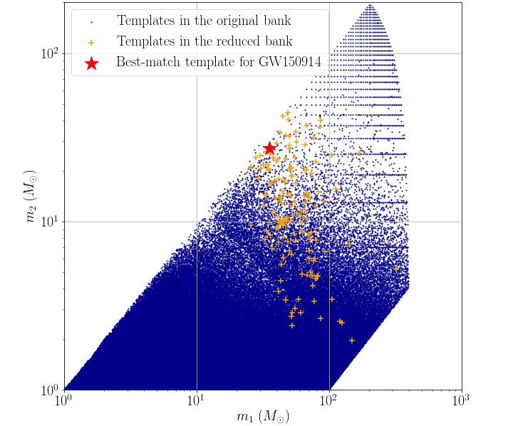

# Data products of targeted search for GW150914

## Reduced template bank

## Candidate list

Note that candidates are ranked in ascending order of FAR.

| Rank | Targeted Event | GPS time | SNR | FAR | Skymap overlap (%) | Remark |
| ------ | ------ | ------ | ------ | ------ | ------ | ------ |
| 1 | GW150914 | 1126259462.43 | 24.3 | 2.444E-27 | 94.8 | This is GW150914 itself. |
| 2 | GW150914 | 1186741861.53 | 16.4 | 1.57E-25 | 17.0 | This is GW170814. |
| 3 | GW150914 | 1186302519.75 | 12.3 | 9.97E-22 | 1.5 | This is GW170809. |
| 4 | GW150914 | 1167559936.60 | 13.2 | 9.80E-18 | 0.0 | This is GW170104. |
| 5 | GW150914 | 1187529256.52 | 11.6 | 5.33E-16 | 0.0 | This is GW170823. |
| 6 | GW150914 | 1187058327.08 | 11.0 | 2.26E-10 | 0.0 | This is GW170818. |
| 7 | GW150914 | 1185389807.33 | 9.4 | 2.78E-09 | 7.1 | This is GW170729. |
| 8 | GW150914 | 1169069154.58 | 10.2 | 3.61E-09 | 0.5 | Found and reported in [2]. |
| 9 | GW150914 | 1128652652.63 | 8.8 | 1.431E-07 | 0.0 | - |
| 10 | GW150914 | 1184951017.32 | 8.6 | 1.71E-07 | 0.0 | - |
| 11 | GW150914 | 1177134832.19 | 8.2 | 2.09E-07 | 0.0 | Found and reported in [2]. |
| 12 | GW150914 | 1134827257.02 | 10.4 | 2.104E-07 | 0.0 | - |
| 13 | GW150914 | 1130229279.89 | 8.4 | 2.537E-07 | 8.5 | - |
| 14 | GW150914 | 1127471831.01 | 8.4 | 3.364E-07 | 46.5 | - |