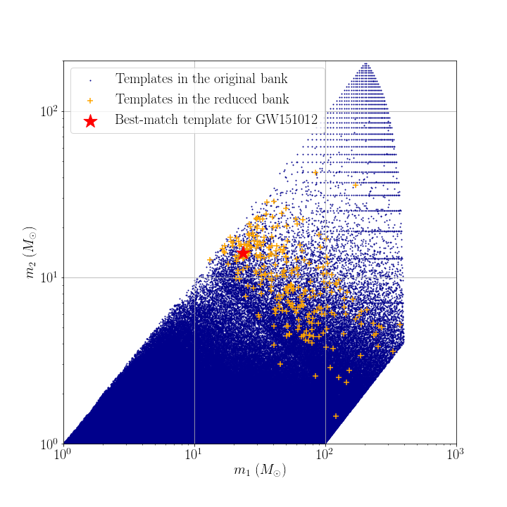

# Data products of targeted search for GW151012

## Reduced template bank

## Range against combined FAR comparison plot
You can download the figure from [range_far_GW151012.pdf](https://git.ligo.org/alvin.li/targeted_subthreshold_search_method_paper_data/-/blob/master/GW151012/Range_FAR_plot_GW151012_O1C5_new.pdf).

## Candidate list

Note that candidates are ranked in ascending order of FAR.

| Rank | Targeted Event | GPS time | SNR | FAR | Skymap overlap (%) | Remark |
| ------ | ------ | ------ | ------ | ------ | ------ | ------ |
| 1 | GW151012 | 1126259462.44 | 19.6 | 1.491E-35 | 0.0 | This is GW150914. |
| 2 | GW151012 | 1128678900.45 | 9.9 | 5.873E-13 | 95.0 | This is GW151012 itself. |
| 3 | GW151012 | 1186741861.54 | 12.2 | 3.043E-11 | 0.0 | This is GW170814. |
| 4 | GW151012 | 1167559936.61 | 9.5 | 2.071E-10 | 3.5 | This is GW170104. |
| 5 | GW151012 | 1170883361.63 | 9.2 | 6.529E-10 | 4.5 | Not reported in paper due to insignificant skymap overlap. |
| 6 | GW151012 | 1186302519.75 | 9.5 | 1.410E-09 | 10.9 | This is GW170809. |
| 7 | GW151012 | 1181307191.37 | 9.8 | 8.627E-09 | 0.0 | Not reported in paper due to insignificant skymap overlap. |
| 8 | GW151012 | 1177817456.78 | 8.4 | 1.155E-07 | 8.7 | - |
| 9 | GW151012 | 1128326804.24 | 11.3 | 2.530E-07 | 0.0 | - |
| 10 | GW151012 | 1164788133.07 | 8.5 | 3.315E-07 | 2.6 | - |