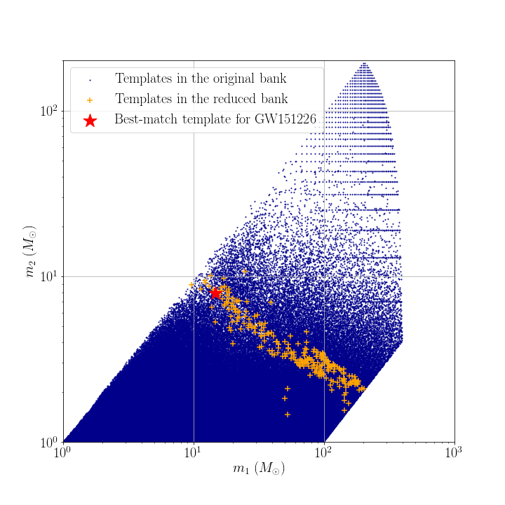

# Data products of targeted search for GW150914

## Reduced template bank

## Range against combined FAR comparison plot
You can download the figure from [range_far_GW150914.pdf](https://git.ligo.org/alvin.li/targeted_subthreshold_search_method_paper_data/-/blob/master/GW151226/Range_FAR_plot_GW151226_O1C6_new.pdf).

## Candidate list

Note that candidates are ranked in ascending order of FAR.

| Rank | Targeted Event | GPS time | SNR | FAR | Skymap overlap (%) | Remark |
| ------ | ------ | ------ | ------ | ------ | ------ | ------ |
| 1 | GW151226 | 1135136350.65 | 12.9 | 2.624E-26 | 93.2 | This is GW151226 itself. |
| 2 | GW151226 | 1176849083.59 | 9.2 | 4.137E-08 | 0.0 | Not reported in paper due to insignificant skymap overlap. |
| 3 | GW151226 | 1172701304.97 | 9.2 | 2.422E-07 | 0.0 | - |
| 4 | GW151226 | 1172102479.11 | 8.2 | 2.428E-07 | 0.0 | - |
| 5 | GW151226 | 1172555841.58 | 8.4 | 2.552E-07 | 1.4 | - |
| 6 | GW151226 | 1172969267.80 | 9.2 | 2.730E-07 | 23.1 | - |