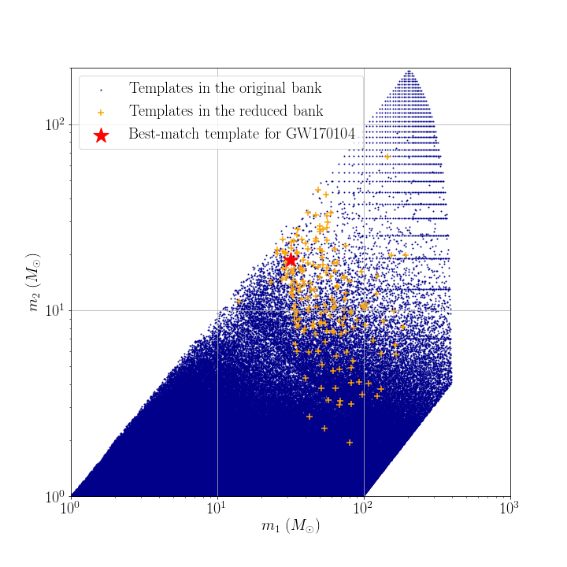

# Data products of targeted search for GW170104

## Reduced template bank

## Range against combined FAR comparison plot
You can download the figure from [range_far_GW150914.pdf](https://git.ligo.org/alvin.li/targeted_subthreshold_search_method_paper_data/-/blob/master/GW150914/Range_FAR_plot_GW170104_O1C9_new.pdf).

## Candidate list

Note that candidates are ranked in ascending order of FAR.

| Rank | Targeted Event | GPS time | SNR | FAR | Skymap overlap (%) | Remark |
| ------ | ------ | ------ | ------ | ------ | ------ | ------ |
| 1 | GW170104 | 1126259462.43 | 24.3 | 4.146E-51 | 0.0 | This is GW150914. |
| 2 | GW170104 | 1186741861.53 | 17.1 | 4.316E-31 | 8.8 | This is GW170814. |
| 3 | GW170104 | 1167559936.60 | 13.3 | 9.222E-21 | 88.6 | This is GW170104 itself. |
| 4 | GW170104 | 1186302519.75 | 12.3 | 1.578E-19 | 15.7 | This is GW170809. |
| 5 | GW170104 | 1187529256.52 | 10.4 | 7.930E-12 | 3.1 | This is GW170823. |
| 6 | GW170104 | 1170079035.73 | 8.7 | 2.720E-08 | 2.6 | Found and reported in [2]. |
| 7 | GW170104 | 1169069154.58 | 9.6 | 9.542E-08 | 7.1 | Found and reported in [2]. |
| 8 | GW170104 | 1128652652.63 | 8.9 | 9.952E-08 | 0.8 | - |
| 9 | GW170104 | 1130243831.10 | 8.8 | 1.701E-07 | 0.0 | - |
| 10 | GW170104 | 1165994194.41 | 9.3 | 2.486E-07 | 11.7 | Found previously by GstLAL (Artifact possibly caused). |

