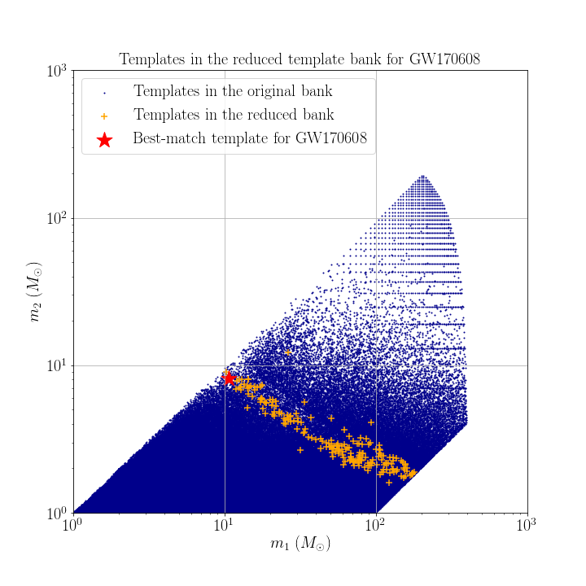

# Data products of targeted search for GW170608

## Reduced template bank

## Range against combined FAR comparison plot
You can download the figure from [range_far_GW150914.pdf](https://git.ligo.org/alvin.li/targeted_subthreshold_search_method_paper_data/-/blob/master/GW170608/Range_FAR_plot_GW170608.pdf).

## Candidate list

Note that candidates are ranked in ascending order of FAR.

| Rank | Targeted Event | GPS time | SNR | FAR | Skymap overlap (%) | Remark |
| ------ | ------ | ------ | ------ | ------ | ------ | ------ |
| 1 | GW170608 | 1134291607.28 | 9.5 | 7.122E-08 | 23.4 | - |
| 2 | GW170608 | 1174511607.75 | 8.6 | 7.324E-08 | 47.9 | - |
| 3 | GW170608 | 1176767132.78 | 8.8 | 1.517E-07 | 57.1 | - |
| 4 | GW170608 | 1134294371.51 | 8.3 | 2.010E-07 | 53.0 | - |
| 5 | GW170608 | 1176798527.18 | 8.4 | 2.039E-07 | 79.6 | - |
| 6 | GW170608 | 1172264374.81 | 9.6 | 2.972E-07 | 43.4 | - |
| 7 | GW170608 | 1173707019.23 | 8.3 | 3.020E-07 | 98.2 | - |
| 8 | GW170608 | 1133136581.02 | 8.7 | 3.733E-07 | 14.1 | - |

