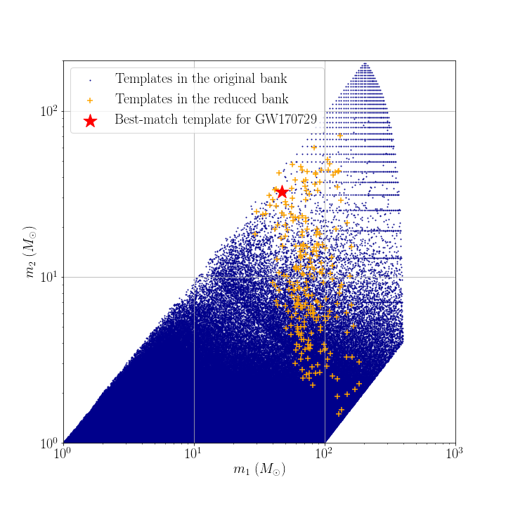

# Data products of targeted search for GW150914

## Reduced template bank

## Range against combined FAR comparison plot
You can download the figure from [range_far_GW150914.pdf](https://git.ligo.org/alvin.li/targeted_subthreshold_search_method_paper_data/-/blob/master/GW170729/Range_FAR_plot_GW170729.pdf).

## Candidate list

Note that candidates are ranked in ascending order of FAR.

| Rank | Targeted Event | GPS time | SNR | FAR | Skymap overlap (%) | Remark |
| ------ | ------ | ------ | ------ | ------ | ------ | ------ |
| 1 | GW170729 | 1126259462.43 | 24.3 | 5.131E-28 | 1.5 | This is GW150914. |
| 2 | GW170729 | 1186741861.53 | 16.4 | 1.29E-15 | 0.5 | This is GW170814. |
| 3 | GW170729 | 1167559936.60 | 13.2 | 1.33E-15 | 15.0 | This is GW170104. |
| 4 | GW170729 | 1187529256.52 | 11.2 | 8.49E-13 | 8.7 | This is GW170823. |
| 5 | GW170729 | 1185389807.32 | 10.4 | 5.98E-12 | 89.9 | This is GW170729 itself. |
| 6 | GW170729 | 1186302519.75 | 12.0 | 4.25E-11 | 0.0 | This is GW170809. |
| 7 | GW170729 | 1169069154.58 | 10.1 | 7.09E-09 | 4.3 | Found and reported in [2]. |
| 8 | GW170729 | 1187058327.08 | 11.0 | 3.02E-08 | 12.3 | This is GW170818. |
| 9 | GW170729 | 1177134832.19 | 8.3 | 1.30E-07 | 7.4 | Found and reported in [2]. |
| 10 | GW170729 | 1172680691.37 | 8.6 | 1.53E-07 | 1.0 | Found and reported in [2]. |
| 11 | GW170729 | 1128626886.60 | 8.6 | 1.578E-07 | 2.2 | Found and reported in [2]. |
| 12 | GW170729 | 1128673106.72 | 8.8 | 1.738E-07 | 5.7 | - |
| 13 | GW170729 | 1127665907.02 | 8.9 | 2.182E-07 | 0.0 | - |
| 14 | GW170729 | 1127478503.18 | 8.5 | 2.735E-07 | 14.3 | - |
| 15 | GW170729 | 1128652652.63 | 8.9 | 3.036E-07 | 8.2 | - |
| 16 | GW170729 | 1175669025.77 | 8.1 | 3.11E-07 | 17.0 | - |
| 17 | GW170729 | 1185152688.04 | 8.5 | 3.803E-07 | 6.7 | Found and reported in [2]. |

