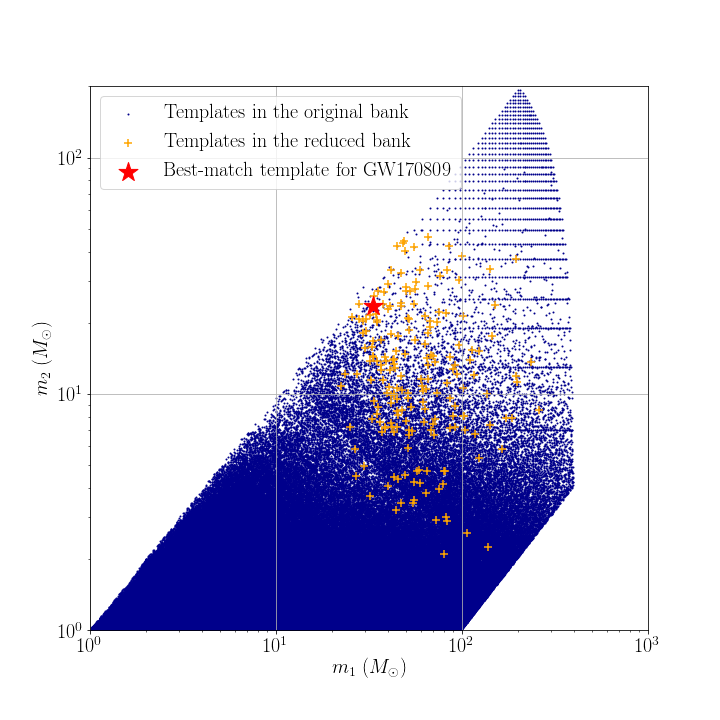

# Data products of targeted search for GW170809

## Reduced template bank

## Range against combined FAR comparison plot
You can download the figure from [range_far_GW150914.pdf](https://git.ligo.org/alvin.li/targeted_subthreshold_search_method_paper_data/-/blob/master/GW170809/Range_FAR_plot_GW170809_O2C12.pdf).

## Candidate list

Note that candidates are ranked in ascending order of FAR.

| Rank | Targeted Event | GPS time | SNR | FAR | Skymap overlap (%) | Remark |
| ------ | ------ | ------ | ------ | ------ | ------ | ------ |
| 1 | GW170809 | 1126259462.43 | 22.1 | 2.223E-30 | 2.6 | This is GW150914. |
| 2 | GW170809 | 1186741861.53 | 16.4 | 8.26E-28 | 15.7 | This is GW170814. |
| 3 | GW170809 | 1167559936.60 | 13.2 | 1.41E-19 | 10.2 | This is GW170104. |
| 4 | GW170809 | 1186302519.75 | 12.3 | 3.58E-17 | 90.3 | This is GW170809 itself. |
| 5 | GW170809 | 1187529256.52 | 11.3 | 1.54E-14 | 3.6 | This is GW170823. |
| 6 | GW170809 | 1185389807.33 | 9.6 | 1.02E-09 | 0.0 | This is GW170729. |
| 7 | GW170809 | 1169069154.58 | 10.2 | 1.35E-09 | 0.0 | Found and reported in [2]. |
| 8 | GW170809 | 1187058327.08 | 11.0 | 2.00E-09 | 0.4 | This is GW170818. |
| 9 | GW170809 | 1165994194.41 | 9.2 | 1.81E-07 | 41.3 | Found previously by GstLAL (Artifact possibly caused). |
| 10 | GW170809 | 1128652652.63 | 8.8 | 1.980E-07 | 0.0 | - |
| 11 | GW170809 | 1130229279.89 | 8.4 | 3.829E-07 | 0.0 | - |

