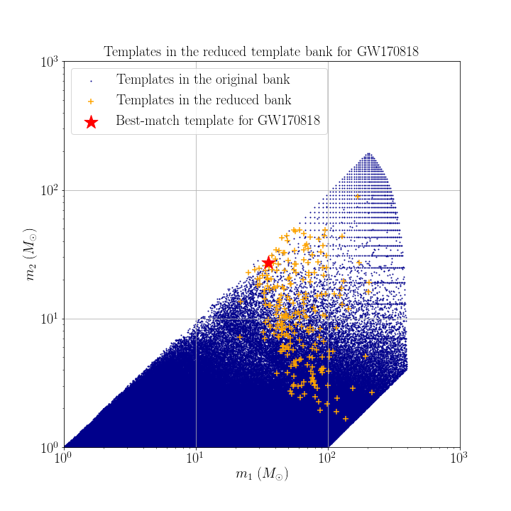

# Data products of targeted search for GW150914

## Reduced template bank

## Range against combined FAR comparison plot
You can download the figure from [range_far_GW150914.pdf](https://git.ligo.org/alvin.li/targeted_subthreshold_search_method_paper_data/-/blob/master/GW170818/Range_FAR_plot_GW170818.png).

## Candidate list

Note that candidates are ranked in ascending order of FAR.

| Rank | Targeted Event | GPS time | SNR | FAR | Skymap overlap (%) | Remark |
| ------ | ------ | ------ | ------ | ------ | ------ | ------ |
| 1 | GW170818 | 1126259462.43 | 24.3 | 3.509E-29 | 100.0 | This is GW150914. |
| 2 | GW170818 | 1186741861.53 | 16.4 | 1.88E-24 | 48.0 | This is GW170814. |
| 3 | GW170818 | 1167559936.60 | 13.1 | 1.16E-17 | 31.8 | This is GW170104. |
| 4 | GW170818 | 1186302519.75 | 12.2 | 7.31E-17 | 14.0 | This is GW170809. |
| 5 | GW170818 | 1187529256.52 | 11.6 | 4.34E-14 | 2.7 | This is GW170823. |
| 6 | GW170818 | 1185389807.33 | 10.4 | 6.53E-12 | 25.4 | This is GW170729. |
| 7 | GW170818 | 1169069154.58 | 10.2 | 2.37E-09 | 18.1 | Found and reported in [2]. |
| 8 | GW170818 | 1187058327.08 | 9.6 | 9.91E-09 | 56.6 | This is GW170818 itself. |
| 9 | GW170818 | 1128755912.91 | 8.9 | 6.905E-08 | 100.0 | - |
| 10 | GW170818 | 1172680691.37 | 8.6 | 1.11E-07 | 30.6 | Found and reported in [2]. |
| 11 | GW170818 | 1128652652.63 | 8.9 | 2.002E-07 | 77.0 | - |
| 12 | GW170818 | 1170079035.73 | 8.3 | 2.68E-07 | 58.3 | Found and reported in [2]. |
| 13 | GW170818 | 1128626886.60 | 8.4 | 2.870E-07 | 46.2 | Found and reported in [2]. |
| 14 | GW170818 | 1177134832.19 | 8.2 | 3.32E-07 | 29.8 | Found and reported in [2]. |