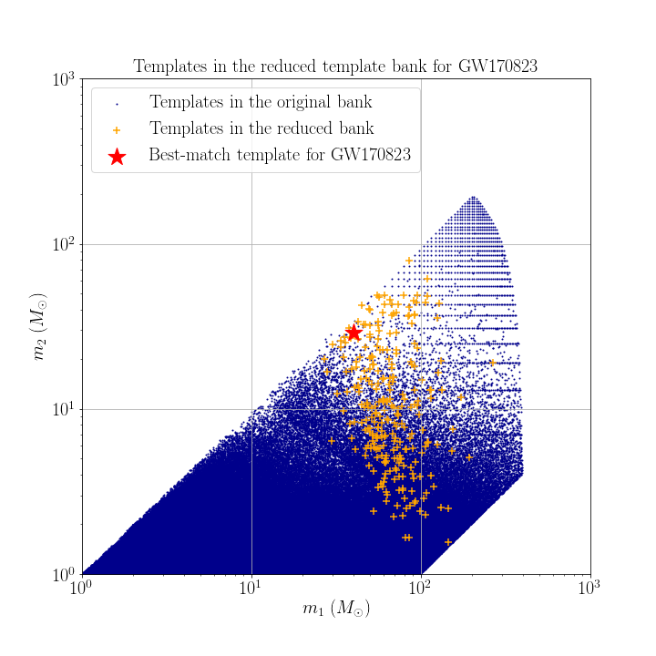

# Data products of targeted search for GW170823

## Reduced template bank

## Range against combined FAR comparison plot
You can download the figure from [range_far_GW150914.pdf](https://git.ligo.org/alvin.li/targeted_subthreshold_search_method_paper_data/-/blob/master/GW170823/Range_FAR_plot_GW170823.pdf).

## Candidate list

Note that candidates are ranked in ascending order of FAR.

| Rank | Targeted Event | GPS time | SNR | FAR | Skymap overlap (%) | Remark |
| ------ | ------ | ------ | ------ | ------ | ------ | ------ |
| 1 | GW170823 | 1126259462 | 24.259 | 1.935E-51 | 0.0 | This is GW150914. |
| 2 | GW170823 | 1186741861.53 | 16.3 | 5.97E-20 | 0.0 | This is GW170814. |
| 3 | GW170823 | 1186302519.75 | 12.3 | 3.04E-17 | 3.8 | This is GW170809. |
| 4 | GW170823 | 1167559936.60 | 12.4 | 2.30E-16 | 4.3 | This is GW170104. |
| 5 | GW170823 | 1187529256.52 | 11.4 | 1.23E-14 | 81.4 | This is GW170823 itself. |
| 6 | GW170823 | 1185389807.32 | 10.4 | 2.78E-12 | 7.5 | This is GW170729. |
| 7 | GW170823 | 1169069154.58 | 10.1 | 2.84E-09 | 2.0 | Found and reported in [2]. |
| 8 | GW170823 | 1128678900.45 | 8.8 | 4.538E-09 | 32.9 | This is GW151012. |
| 9 | GW170823 | 1187058327.08 | 10.0 | 1.30E-08 | 4.7 | This is GW170818. |
| 10 | GW170823 | 1177134832.19 | 8.3 | 8.53E-08 | 0.3 | Found and reported in [2]. |
| 11 | GW170823 | 1172680691.37 | 8.6 | 1.14E-07 | 1.3 | Found and reported in [2]. |
| 12 | GW170823 | 1168668565.53 | 8.5 | 1.16E-07 | 19.9 | - |
| 13 | GW170823 | 1128652652.63 | 8.9 | 1.262E-07 | 8.7 | - |
| 14 | GW170823 | 1127478503.18 | 8.7 | 1.650E-07 | 19.1 | - |
| 15 | GW170823 | 1130243831.11 | 8.9 | 1.745E-07 | 13.7 | - |
| 16 | GW170823 | 1128626886.60 | 8.5 | 2.010E-07 | 17.3 | Found and reported in [2]. |
| 17 | GW170823 | 1130229279.89 | 8.5 | 2.453E-07 | 0.0 | - |
| 18 | GW170823 | 1128673106.72 | 8.8 | 2.685E-07 | 0.2 | - |
| 19 | GW170823 | 1185152688.04 | 8.5 | 2.92E-07 | 9.9 | Found and reported in [2]. |
